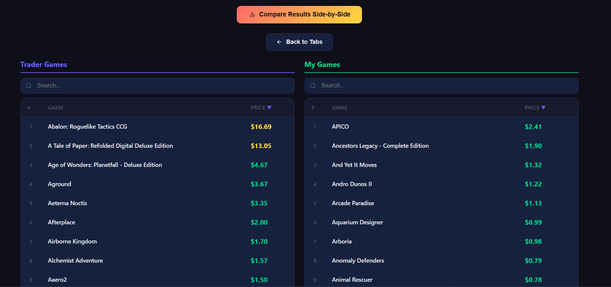

# GG.Deals Price Scraper

A web-based price lookup tool built for **Steam game traders**. Quickly check current best prices on [gg.deals](https://gg.deals) for bulk game lists — perfect for evaluating trade offers, pricing your inventory, or comparing your collection against a trader's list.

Whether you're buying, selling, or swapping Steam keys, this tool lets you paste a list of game names and instantly see the best available prices across all stores tracked by gg.deals.

  

## Features

- **Dual-tab interface** — two independent tabs ("Trader Games" & "My Games") for managing separate game lists
- **Parallel scraping** — both tabs can scrape simultaneously with configurable worker counts
- **Side-by-side comparison** — compare results from both tabs to evaluate trade value at a glance
- **Multi-worker scraping** — configurable number of parallel browser instances per tab
- **Real-time progress** — live progress bar via Server-Sent Events
- **Search & filter** — filter results by price availability or match confidence
- **Sort & export** — sort by name/price, export to CSV or clipboard
- **Delete individual results** — remove specific games from the results
- **Compare view tools** — search and sort by price within the comparison view

## Use Cases

- **Evaluating trade offers** — paste the trader's game list in one tab and your games in the other, then compare total values side-by-side
- **Pricing your inventory** — bulk-check current prices for all your tradeable Steam keys
- **Finding deals** — identify undervalued games in a trade offer by sorting by price

## Getting Started

> **Prerequisite:** Google Chrome must be installed.

### Option 1: Download the .exe (Windows — no Python needed)

1. Download **`GG Deals Scraper.exe`** from the [Releases](../../releases) page
2. Double-click the `.exe` — a console window opens and your browser launches automatically
3. Start scraping!

### Option 2: Run from source

1. Make sure you have **Python 3.10+** and **Google Chrome** installed
2. Set up the project:
   ```bash
   # Create virtual environment
   python -m venv venv

   # Activate it
   # Windows:
   venv\Scripts\activate
   # Linux/macOS:
   source venv/bin/activate

   # Install dependencies
   pip install -r requirements.txt
   ```
3. Run the app:
   ```bash
   python app.py
   ```
4. Open [http://127.0.0.1:5000](http://127.0.0.1:5000) in your browser

### Option 3: Build the .exe yourself

1. Follow the setup steps from Option 2
2. Build:
   ```bash
   pip install pyinstaller
   pyinstaller --clean GG_Deals_Scraper.spec
   ```
   Or on Windows, just double-click `build.bat`.
3. The executable will be at `dist/GG Deals Scraper.exe`

## Screenshot



## How to Use

1. **Add games** — type game names (one per line) or upload a `.txt` file in either tab:
   ```
   Frostpunk
   DOOM Eternal
   Borderlands 3
   Hollow Knight
   Celeste
   ```
2. **Set workers** — choose how many parallel browsers to run per tab (more = faster, but heavier on resources)
3. **Start scraping** — click "Start Scraping" on one or both tabs and watch the progress bars
4. **View results** — browse, search, filter, and export the scraped prices
5. **Compare** — when both tabs have results, click "Compare Results Side-by-Side" to see total values and search/sort within each column

> **Note:** The scraper runs Chrome in visible mode because gg.deals blocks headless browsers. Running both tabs with 3+ workers each may strain system resources.

## Project Structure

```
├── app.py                  # Flask web server & per-tab API endpoints
├── scraper.py              # Multi-threaded scraping logic (per-instance state)
├── templates/
│   └── index.html          # Frontend UI (dual-tab single-page app)
├── games.txt               # Default game list
├── requirements.txt        # Python dependencies
├── GG_Deals_Scraper.spec   # PyInstaller build config
├── build.bat               # One-click build script (Windows)
├── *_results.json          # Scraped results per tab (generated at runtime)
└── *_progress.json         # Scraping progress per tab (generated at runtime)
```

## Tech Stack

- **Backend:** Flask, Selenium, undetected-chromedriver
- **Frontend:** Vanilla HTML/CSS/JS with a dark theme
- **Scraping:** Multi-threaded with per-instance browser workers
